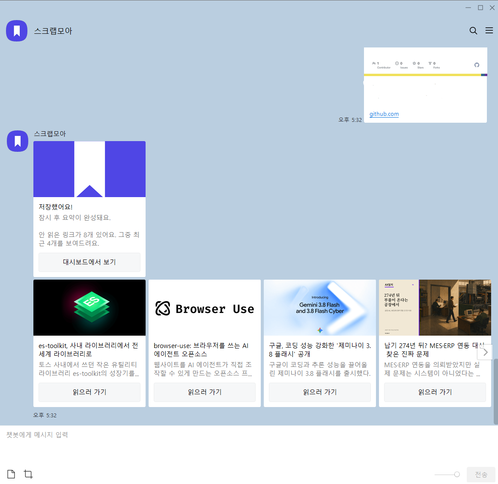
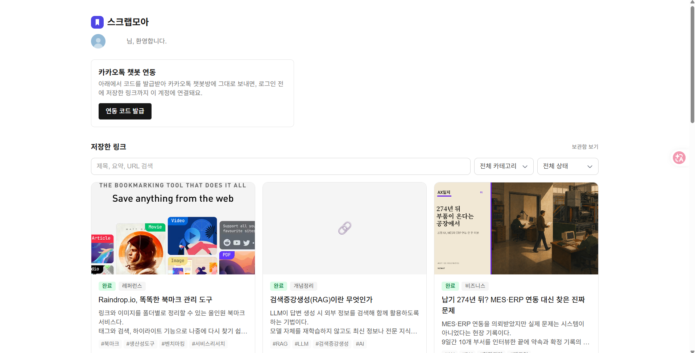
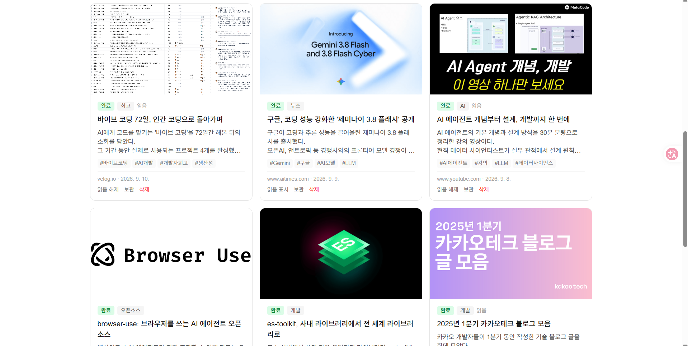

<p align="center">
  
</p>

<h1 align="center">스크랩모아</h1>
<p align="center">카톡에 링크만 던지면, AI가 알아서 정리해주는 초경량 북마크 서비스</p>

<p align="center">
  
  
</p>
<p align="center">
  
</p>

## 무엇을 하는 서비스인가요

"이거 나중에 봐야지" 하고 채팅방이나 메모장에 링크만 쌓아두고 결국 안 보게 되는 경험을 줄여보려고 만든 사이드 프로젝트입니다.

1. 카카오톡 채널에 링크를 붙여넣으면
2. 5초 안에 "저장했어요" 응답이 오고
3. 백그라운드에서 크롤링 + Gemini 요약이 진행되고
4. 카카오 로그인으로 웹 대시보드에서 검색·필터·모아보기를 할 수 있습니다.

크롤링이나 AI 요약이 실패해도 원본 링크는 반드시 저장되고("저장 실패는 있어도 데이터 유실은 없다"), 안 읽은 링크는 챗봇이 슬쩍 리마인드해줍니다.

## 핵심 기능

- **URL 자동 추출**: 문장 중간에 섞인 링크도 정규식으로 추출
- **로그인 전 저장 → 소급 연동**: 대시보드에서 발급한 6자리 코드를 챗봇에 입력하면, 로그인 전에 저장한 링크까지 계정에 연결
- **AI 자동 정리**: Gemini Flash가 제목 / 3줄 요약 / 카테고리 / 태그를 생성
- **안 읽음 리마인드**: 링크를 저장할 때마다 밀린 안 읽은 링크를 카카오톡 카드로 슬쩍 보여줌
- **실패 안전망**: 크롤링/요약 실패 시에도 원본 URL 보존, 상태별(pending/processed/failed/restricted/quota_exceeded) 뱃지 표시, Vercel Cron으로 pending 재처리

## 기술 스택

| 영역 | 기술 |
|---|---|
| 프레임워크 | Next.js (App Router), Vercel Hobby 배포 |
| DB / Auth | Supabase (PostgreSQL, RLS) |
| 로그인 | 카카오 OIDC + `signInWithIdToken` |
| AI | Google Gemini Flash (AI Studio 무료 티어) |
| 백그라운드 처리 | `@vercel/functions`의 `waitUntil` |
| 크롤링 | fetch + OG 메타태그 파싱, `jsdom` + `@mozilla/readability` |
| 스타일링 | Tailwind CSS |

운영비 0원을 목표로, 모든 구성 요소가 무료 티어 한도 안에서 동작하도록 설계했습니다.

## 로컬에서 실행하기

```bash
npm install
cp .env.example .env.local   # 값 채워넣기
npm run dev -- -p 3001
```

`.env.local`에 필요한 값:

- `SUPABASE_URL`, `SUPABASE_SERVICE_ROLE_KEY`, `SUPABASE_ANON_KEY`
- `NEXT_PUBLIC_SUPABASE_URL`, `NEXT_PUBLIC_SUPABASE_ANON_KEY`
- `NEXT_PUBLIC_KAKAO_REST_API_KEY`, `KAKAO_CLIENT_SECRET`, `NEXT_PUBLIC_KAKAO_REDIRECT_URI`
- `GEMINI_API_KEY`
- `CRON_SECRET`, `KAKAO_SKILL_SECRET`

DB 스키마는 `supabase/migrations/`의 마이그레이션 파일을 Supabase 프로젝트에 순서대로 적용하면 됩니다.

## 폴더 구조

```
app/
  api/kakao-webhook/    # 카카오 오픈빌더 스킬 서버 (5초 응답 제한, waitUntil로 백그라운드 처리)
  api/cron/process-links/ # pending 상태로 남은 링크 재처리 (Vercel Cron)
  api/auth/kakao/callback/
  dashboard/            # 로그인 후 링크 목록/검색/필터
  login/
lib/
  crawler.js            # OG 메타태그 + Readability 본문 추출
  gemini.js             # Gemini Flash 요약 호출
  linkProcessor.js       # 크롤링 → AI 요약 → DB 업데이트 파이프라인
supabase/migrations/    # DB 스키마 (SQL)
```
